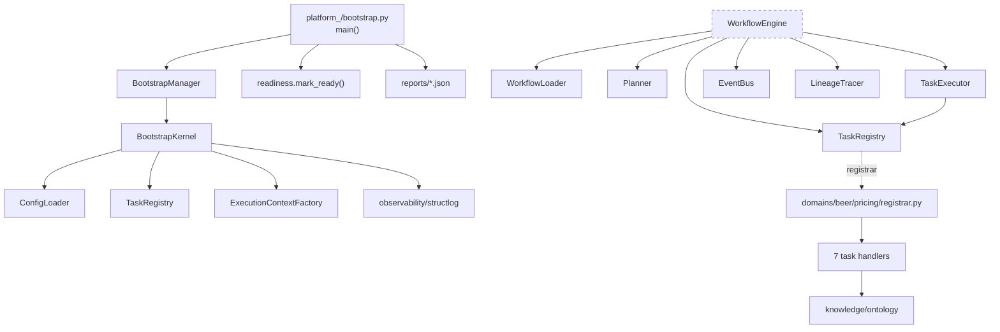
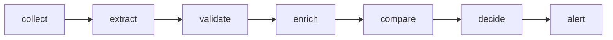
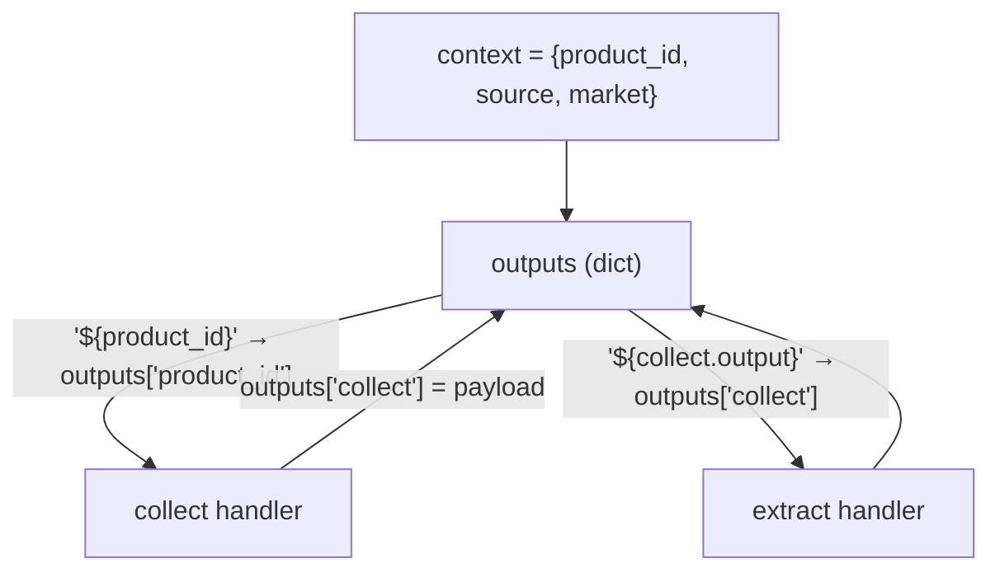
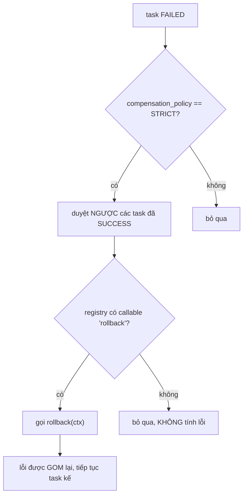
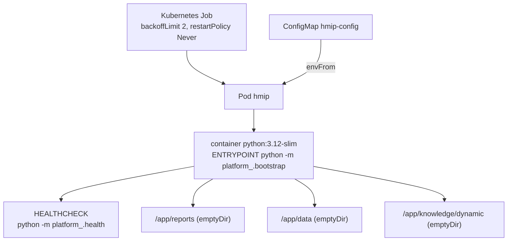

# ARCHITECTURE — HMIP

> Phase 2 + 3 output. Mọi claim quan trọng đều kèm evidence (file + symbol).

## 1. Architectural style

`[VERIFIED]` **Layered kernel + plugin-style domain registration**, chạy đồng bộ, đơn tiến trình.

Bằng chứng cho từng đặc tính:

| Đặc tính | Evidence |
|---|---|
| Đơn tiến trình, đồng bộ | `WorkflowEngine.execute()` là vòng `for` tuần tự, không async/thread pool — `core/workflow_engine.py` L138-190 |
| Domain cắm vào kernel qua callback | `TaskRegistrar = Callable[[TaskRegistry], None]`, inject qua constructor — `core/workflow_engine.py` L47, `core/bootstrap.py` L49 |
| Kernel không biết domain | `core/` không import `domains/` ở bất kỳ đâu — `[VERIFIED]` grep 0 kết quả |
| Contract-driven | Mỗi module docstring khoá shape theo `05_Interface_Contract.md` |

## 2. Component diagram



> Đường nét đứt: `WorkflowEngine` **không được nối vào CLI nào** — xem F-01.

## 3. Component responsibilities  `[VERIFIED]`

| Component | File | Trách nhiệm | Ranh giới được giữ |
|---|---|---|---|
| `BootstrapKernel` | `core/bootstrap.py` | 8 bước chuẩn bị runtime | Không raise; mọi bước fail đều thành `TaskExecutionResult(FAILED)` (L124-148) |
| `ConfigLoader` | `core/config.py` | load → merge → expand `${VAR:-default}` → validate → freeze | 4 method tách rời, không phải pipeline kín (L82-104) |
| `FrozenConfig` | `core/config.py` | snapshot bất biến + fingerprint SHA256 | `MappingProxyType` + deepcopy (L38) |
| `TaskRegistry` | `core/registry.py` | đăng ký task, state machine | READY→FROZEN→EXECUTING→{COMPLETED,FAILED}, thread-safe RLock (L44-52) |
| `Planner` | `core/planner.py` | dựng wave DAG, phát hiện chu trình | Stateless; **chỉ nơi này** được suy luận thứ tự (L30-58) |
| `TaskExecutor` | `core/executor.py` | chạy 1 task + retry + resolve template | Không raise cho lỗi nghiệp vụ (L104-143) |
| `WorkflowEngine` | `core/workflow_engine.py` | tuần tự hoá wave + compensation | Uỷ thác planning cho Planner (L131) |
| `EventBus` | `core/event_bus.py` | pub/sub đồng bộ | Gom lỗi handler, raise sau khi giao hết (L60-71) |
| `PricingDecisionEngine` | `domains/.../decision_engine.py` | ngưỡng giá | Sở hữu toàn bộ threshold; `compare_price.py` thuần transform |

## 4. Request/execution flow

Thứ tự thực tế của PRC-001, do `Planner` sinh ra (chuỗi tuyến tính vì mỗi task phụ thuộc task trước):



`[VERIFIED]` `domains/beer/pricing/workflows/WF-PRC-001.yaml` L38-96 (7 task, mỗi task `dependencies` trỏ về task liền trước).

| Task | type | Handler | Ý nghĩa |
|---|---|---|---|
| collect | adapter | `CollectPriceAdapter.fetch` | lấy payload thô (mock) |
| extract | prompt | `ExtractPriceSkill.run` | parse `"18,500"` → `18500.0` |
| validate | schema_validate | `validate_price` | jsonschema với `schemas/schema.json` |
| enrich | transform | `enrich_with_ontology` | đối chiếu ontology, điền `sku` |
| compare | transform | `compute_variance` | tính `delta_percent` |
| decide | decision | `PricingDecisionEngine` | IGNORE/ALERT/ESCALATE/HUMAN_REVIEW |
| alert | notify | `make_alert_handler` | trả dict mô tả thông báo (không gửi thật) |

## 5. Decision logic  `[VERIFIED]` `decision_engine.py` L28-30, L52-63, L65-90

```text
variance = |current - base| / base * 100

variance >= 10%  → ESCALATE      → escalate_to_category_manager
variance >=  5%  → ALERT         → notify_pricing_team
ngược lại        → IGNORE        → (không action)

GHI ĐÈ: confidence < 0.7 → HUMAN_REVIEW → route_to_human_review_queue
```

Override confidence áp **sau** khi tính decision, trong `build_decision_result()` — `evaluate()` thuần theo protocol không biết đến confidence.

## 6. Data flow — template resolution

Cơ chế nối dữ liệu giữa các task **không đi qua** `TaskExecutionResult` (shape bị khoá, không có field `output`). Thay vào đó dùng dict `outputs` bên ngoài:



`[VERIFIED]` `core/executor.py` L44-58 (`_resolve_value` cắt hậu tố `.output`), L133-134 (ghi `outputs[task.id]`), `core/workflow_engine.py` L134 (`outputs = dict(context)` — seed bằng business input).

## 7. Compensation (rollback)

`[VERIFIED]` `core/workflow_engine.py:_compensate` L217-283.



Đặc tính đã xác minh:
- Một rollback lỗi **không** chặn các rollback còn lại; mọi lỗi được gom vào `errors[]` (L275-278).
- Ghi lineage cho bước rollback là **best-effort**: lineage lỗi vẫn tính rollback thành công (L280-282).
- **Cả 7 rollback của PRC-001 hiện đều là no-op.** Cơ chế thật, nội dung rỗng — `registrar.py` docstring tự thừa nhận điều này.

## 8. Error handling philosophy  `[VERIFIED]`

Ranh giới rất nhất quán, đáng ghi nhận:

| Loại lỗi | Cách xử lý | Evidence |
|---|---|---|
| Lỗi nghiệp vụ của task | Trả `TaskExecutionResult(FAILED)`, **không raise** | `executor.py` L136-143 |
| Lỗi cấu trúc workflow | Raise `WorkflowParseException`, fail-fast | `workflow.py` L100-131 |
| Lỗi hạ tầng khi chạy (lineage write, event delivery) | Raise `WorkflowExecutionException` | `workflow_engine.py` L163-170, L180-185 |
| Lỗi bước bootstrap | Ghi FAILED vào report rồi dừng, không raise | `bootstrap.py` L124-148 |

Exception dùng `.code` để phân biệt nguyên nhân thay vì tạo subclass — quyết định có chủ đích, ghi rõ trong `core/exceptions.py` docstring.

## 9. Runtime / deployment architecture



Khác biệt **logical vs runtime** cần nhấn mạnh:

- *Logical*: có WorkflowEngine, event bus, lineage, compensation — nghe như một orchestration platform.
- *Runtime*: container chỉ chạy bootstrap rồi thoát. **Không workflow nào được thực thi trong container.** `[VERIFIED]` `Dockerfile` ENTRYPOINT + F-01.
- Volume dùng `emptyDir` → report/lineage **mất khi pod chết**, dù code viết ra để bền vững. `[VERIFIED]` `job.yaml` L38-44.

## 10. Known limitations  `[VERIFIED]` — đều do chính source tự khai báo

1. `WorkflowExecutionException` không được raise bởi executor (docstring `exceptions.py` L60-65).
2. `RetryPolicy.strategy` được lưu nhưng **không diễn giải** — backoff luôn tuyến tính `base_delay_ms * attempt` (`executor.py` L96-101, L127).
3. `TaskStatus.SKIPPED/RETRYING/CANCELLED` và `BootstrapStatus.PARTIAL` không bao giờ được sinh ra (`models.py` L38-41, L68-72).
4. `WorkflowEngine.cancel()` vô hiệu trên thực tế: `execute()` đồng bộ và tự sinh `execution_id`, caller không thể biết id trước khi hàm trả về (`workflow_engine.py` L285-295 — docstring tự thừa nhận).
5. Secret resolution là stub pass-through (`config.py` L166-168).
6. `_MOCK_SOURCE_DATA` chỉ có 1 bản ghi → workflow chỉ chạy được với `product_id="P123", source="shopee"`.
7. `readiness.clear_ready()` không được gọi ở đâu → marker file tồn tại vĩnh viễn giữa các lần chạy.

## 11. Unverified assumptions

- `[INFERRED]` Ý định thiết kế là để domain khác (ngoài beer/pricing) cắm vào cùng kernel — cấu trúc `domains/<domain>/<subdomain>/` gợi ý vậy nhưng chỉ có đúng 1 domain tồn tại.
- `[UNKNOWN]` Không rõ vì sao `WorkflowEngine` chưa được nối vào CLI: là hạng mục sprint chưa tới, hay là quyết định có chủ đích. Không tài liệu nào trong repo nêu rõ.
