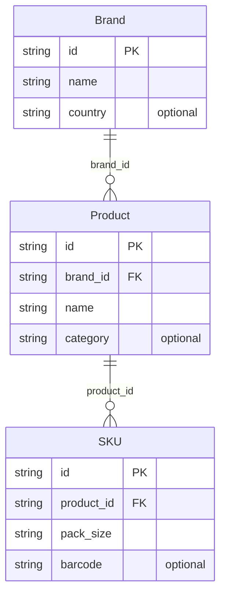

# DATABASE — HMIP

## Kết luận

`[VERIFIED]` **Dự án này KHÔNG có database.**

Bằng chứng:
- Không có ORM, driver, hay client nào trong dependencies (`pyproject.toml` chỉ có pyyaml/structlog/jsonschema).
- Không có thư mục migration, không có file `.sql`, không có schema DDL.
- grep toàn repo: 0 kết quả cho `sqlalchemy`, `psycopg`, `sqlite3`, `pymongo`, `redis`.
- `data/{raw,normalized,processed,validated}/` tồn tại nhưng **tất cả đều rỗng** (chỉ `.gitkeep`).

Tài liệu này giữ lại (thay vì bỏ) chính là để ghi nhận sự vắng mặt đó một cách rõ ràng — theo mục 12 của workflow, phần không tồn tại thì phải nói rõ là không tồn tại, không được bịa.

## Persistence thực tế đang dùng

| Cơ chế | Đường dẫn | Ghi bởi | Đọc bởi |
|---|---|---|---|
| Report JSON | `reports/bootstrap_<execution_id>.json` | `platform_/bootstrap.py` L71-84 | Không code nào đọc lại |
| Lineage JSONL | `knowledge/dynamic/lineage/lineage.jsonl` | `PersistentLineageTracer.record_trace` | `PersistentLineageTracer.query()` |
| Marker readiness | `$HMIP_READY_FILE` hoặc `<tmp>/hmip_ready` | `mark_ready()` | `check_readiness()` |
| Master data (read-only) | `knowledge/master/{brands,products,skus}.json` | — (commit sẵn trong repo) | `OntologyLoader.load_dataset_from_files` |

## Mô hình dữ liệu (in-memory, không có bảng)

`[VERIFIED]` `knowledge/ontology/models.py` L20-96; quan hệ được cưỡng chế trong `loader.py:load_dataset` L107-145 (raise `ONTOLOGY_UNKNOWN_BRAND_REFERENCE` / `ONTOLOGY_UNKNOWN_PRODUCT_REFERENCE`).

`OntologyDataset` lưu 3 dict keyed by id để tra cứu O(1), kèm 2 helper `get_brand_for_product()`, `get_product_for_sku()`.

## Lineage record

`[VERIFIED]` `core/lineage.py` L31-44 — shape khoá theo `12_Data_Contract.md` section 8.1:

| Field | Kiểu | Ghi chú |
|---|---|---|
| `step` | str | task id, hoặc `rollback:<id>` |
| `input_value` | Any | serialize JSON, fallback `str()` |
| `output_value` | Any | như trên |
| `model_info` | str | `task:<id>:<type>` hoặc `compensation:<id>` |
| `timestamp` | float | `time.time()` |
| `integrity_hash` | str | `"sha256:" + sha256(canonical JSON của output)` |

Hạn chế đã ghi nhận trong docstring: giá trị không JSON-serializable được ghi qua `str()` và **đọc lại thành chuỗi**, không khôi phục được object gốc.

## Transaction

Không có transaction theo nghĩa database. Cơ chế tương đương gần nhất là **compensation** (saga pattern) — xem `ARCHITECTURE.md` mục 7.
